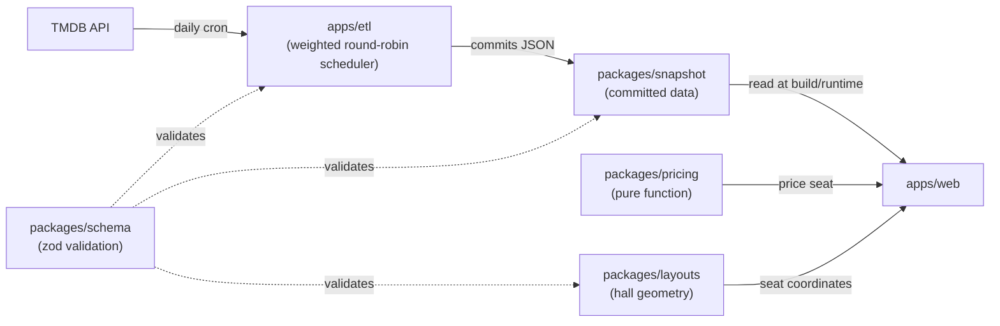

# Architecture

This is an npm-workspaces monorepo. Every package/app description below is pulled directly
from its own `package.json` — this file doesn't restate anything the code doesn't already say
about itself.

## Layout

| Path                                     | What it is                                                                                                                                                                                                                                            |
| ---------------------------------------- | ----------------------------------------------------------------------------------------------------------------------------------------------------------------------------------------------------------------------------------------------------- |
| [`packages/pricing`](packages/pricing)   | Pure, isomorphic demand-based pricing engine. Zero runtime dependencies. Runs identically in the browser and on the server so a quoted price and a charged price can never diverge.                                                                   |
| [`packages/schema`](packages/schema)     | Shared zod schemas for auditorium layouts, showtimes, and seats — the API and the web app import types from here so their data shapes cannot drift apart.                                                                                             |
| [`packages/layouts`](packages/layouts)   | Hand-authored fictional auditorium layouts for Meridian Cinemas, plus the generator/validator scripts used to build them.                                                                                                                             |
| [`packages/snapshot`](packages/snapshot) | The committed output of `apps/etl`'s ingest run: this week's real TMDB films and showtimes. Regenerated daily by [`ingest.yml`](.github/workflows/ingest.yml). `apps/web` reads these directly, so the demo works even with the backend fully asleep. |
| [`apps/etl`](apps/etl)                   | Fetches current/upcoming films from TMDB, allocates them into Meridian Cinemas' showtime grid, and writes the result to `packages/snapshot` — the data `apps/web` actually renders.                                                                   |
| [`apps/web`](apps/web)                   | React + Vite + Tailwind demo app — the film browsing UI, interactive seat map, and live pricing breakdown that ties every other package together.                                                                                                     |

`apps/api` doesn't exist yet — it's M4 on the [roadmap](README.md#roadmap), a real backend for
concurrency-safe seat holds. `apps/web` currently ships a client-side **simulation** of that
experience (clearly labeled as such in the UI) rather than pretending the real thing exists
early.

## Data flow

`packages/pricing` doesn't know `apps/web` exists — it's a pure function of a
`PriceContext`, no I/O, no clock read internally. That's deliberate: the same function that
prices a seat in the browser today is the function a future `apps/api` would call to actually
charge a card in M4, with zero logic duplicated or reimplemented for "the real version."

## Design principles

- **Validate at every boundary.** Anything that enters the system from outside TypeScript's
  own type system — a TMDB API response, a hand-authored layout JSON file, the committed
  snapshot — gets parsed through a `packages/schema` zod schema before anything downstream
  touches it. A malformed snapshot commit fails loudly at module load, not silently at render
  time.
- **Purity where it matters.** `packages/pricing`'s `price()` function takes a fully-computed
  context and returns a deterministic result — no hidden `Date.now()`, no network calls. That
  purity is what makes its property-based test suite (`packages/pricing/test/properties.test.ts`)
  meaningful: the same invariants (never breaching the floor/ceiling, always deterministic,
  always a positive integer number of cents) hold across the entire input domain, not just
  hand-picked examples.
- **Honesty about real vs. simulated.** The [README](README.md) and the UI itself are
  explicit about which numbers come from real data (a showtime's actual scheduled time, a
  film's actual release date) versus which are still simulated for the demo (seat occupancy,
  demand velocity, the seat-hold checkout flow). Nothing is presented as more real than it is.
- **No dead infrastructure.** There's no backend, database, or API layer until one is
  actually needed for something the frontend can't fake — `apps/web` is fully static and
  reads `packages/snapshot` directly, which is also why it deploys as a single static site on
  Vercel with no server to keep warm.

## Tooling

- **TypeScript**, `strict` + `noUncheckedIndexedAccess` + `exactOptionalPropertyTypes`
  everywhere (see [`tsconfig.base.json`](tsconfig.base.json)).
- **ESLint** (flat config, [`eslint.config.js`](eslint.config.js)) with type-aware rules via
  `typescript-eslint`, `eslint-plugin-react-hooks`, and `eslint-plugin-jsx-a11y` — the
  accessibility linting ties directly to the seat map's hand-built keyboard navigation and
  ARIA roles.
- **Prettier** for formatting, wired to run alongside lint in CI.
- **Vitest**, including property-based tests (`fast-check`) for the pricing engine's
  invariants, not just example-based unit tests.
